# Academic Workflow Skills series roadmap

Evidence snapshot: 2026-08-11

`academic-workflow-skills` is the first public release from a broader private,
local-first academic workflow maintained by the repository owner. The public
series begins with the two components that could be separated from private
research data and released with synthetic fixtures, explicit rights boundaries,
tests, and deterministic packages.

Private source code, manuscripts, full-text research material, knowledge-base
content, account data, and local configuration are not included in this
repository.

## System context

The broader local workflow has the following intended separation of concerns.
Not every node in this diagram is public or fully accepted.

```mermaid
flowchart LR
    A["Authorized source material"] --> B["Local normalization and provenance capture"]
    B --> C["Evidence windows and audited knowledge reports"]
    C --> D["Staging and shadow admission"]
    D --> E["Formal local knowledge library"]
    E --> F["Topic, framework, or manuscript intake"]
    F --> G["Evidence-bounded authoring"]
    G --> H["Isolated review"]
    H --> I["Human decision"]
    I --> J["Isolated finalization and document audit"]
    J --> K["Journal strategy"]
```

The current public literature Skill covers a rights-safe discovery and metadata
processing boundary near the start of this chain. The current public submission
Skill covers human-led journal strategy near the end. The intervening private
components explain why the repository is organized as a series rather than as
two unrelated prompts.

## Maintainer-local verification

The following checks were run against private local implementations on
2026-08-11. They are maintainer evidence, not independently reproducible public
CI evidence.

- Writing workflow: 38 focused contract tests passed. The checks cover two
  typed intake routes, complete-manuscript revision and topic/framework
  zero-draft, reaching an audited human-review candidate; they also cover
  immutable evidence bindings, role isolation, and refusal to finalize without
  current human authorization.
- Knowledge supply: 47 focused contract tests passed. The checks cover the
  `knowledge_report@2` contract, citation-use fields, source and locator
  handling, silent-drop rejection, writer-supply usefulness, and delivery
  verification.

These checks establish implemented local workflow contracts. They do not prove
real-model manuscript quality, human acceptance of a current manuscript,
complete corpus ingestion, a production knowledge-library apply, or external
project adoption.

## Public and candidate components

| Component | Current status | Publication boundary |
| --- | --- | --- |
| Literature discovery and review packet | Public in `cnki-literature-review` | Manual account use; local processing of user-supplied metadata |
| Journal-fit and submission preparation | Public in `world-history-submission-strategy` | Advice only; no account or submission action |
| Provenance-aware knowledge supply | Private local implementation | Candidate only after data separation, rights review, synthetic fixtures, and public tests |
| Evidence-bounded writing and review | Private local implementation | Candidate only after prompt, template, manuscript, and provider-boundary audits |
| Formal document production and audit | Private local implementation | Candidate only after platform dependencies and release contracts can be generalized |

## Release gates for future components

A private component can join the public series only after all of these gates are
satisfied:

1. Third-party rights and license provenance are documented.
2. Private manuscripts, restricted text, knowledge-base records, credentials,
   account identifiers, and machine-specific configuration are removed.
3. Runtime examples use synthetic or explicitly redistributable fixtures.
4. Account access, production data writes, and irreversible external actions are
   excluded or placed behind explicit human control.
5. The generalized component has focused tests, a public release scan,
   documentation, and a reproducible package.

## Claims this roadmap does not make

- The private repositories are not open-source dependencies of this release.
- Local test evidence is not a substitute for stars, downloads, users, issues,
  contributions, or other public adoption evidence.
- A deterministic workflow candidate is not a publishable manuscript or a
  journal acceptance forecast.
- No production knowledge-base import or journal submission is authorized by
  this roadmap.
